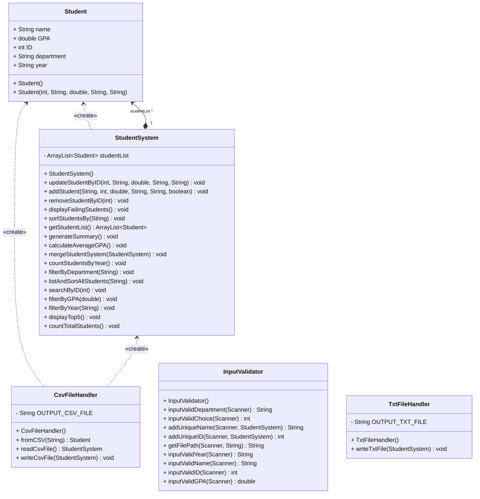

# Student Management System

## UML Diagram

```mermaid
classDiagram
direction BT

class CsvFileHandler {
  + CsvFileHandler() 
  - String OUTPUT_CSV_FILE
  + fromCSV(String) Student
  + readCsvFile() StudentSystem
  + writeCsvFile(StudentSystem) void
}

class InputValidator {
  + InputValidator() 
  + inputValidDepartment(Scanner) String
  + inputValidChoice(Scanner) int
  + addUniqueName(Scanner, StudentSystem) String
  + addUniqueID(Scanner, StudentSystem) int
  + getFilePath(Scanner, String) String
  + inputValidYear(Scanner) String
  + inputValidName(Scanner) String
  + inputValidID(Scanner) int
  + inputValidGPA(Scanner) double
}

class Student {
  + Student() 
  + Student(int, String, double, String, String) 
  + String name
  + double GPA
  + int ID
  + String department
  + String year
}

class StudentSystem {
  - ArrayList~Student~ studentList
  + StudentSystem() 
  + updateStudentByID(int, String, double, String, String) void
  + addStudent(String, int, double, String, String, boolean) void
  + removeStudentByID(int) void
  + displayFailingStudents() void
  + sortStudentsBy(String) void
  + getStudentList() ArrayList~Student~
  + generateSummary() void
  + calculateAverageGPA() void
  + mergeStudentSystem(StudentSystem) void
  + countStudentsByYear() void
  + filterByDepartment(String) void
  + listAndSortAllStudents(String) void
  + searchByID(int) void
  + filterByGPA(double) void
  + filterByYear(String) void
  + displayTop5() void
  + countTotalStudents() void
}

class TxtFileHandler {
  - String OUTPUT_TXT_FILE
  + TxtFileHandler() 
  + writeTxtFile(StudentSystem) void
}

CsvFileHandler ..> Student : «create»
CsvFileHandler ..> StudentSystem : «create»
StudentSystem ..> Student : «create»
StudentSystem "1" *--> "studentList *" Student 
```
